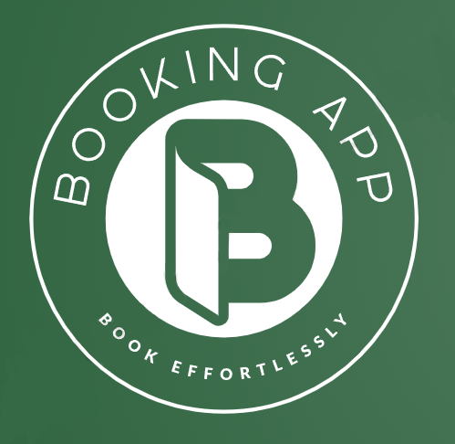
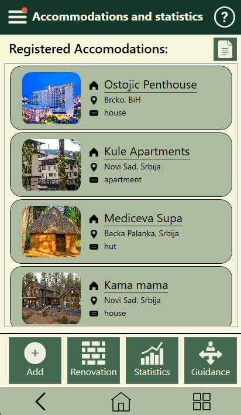
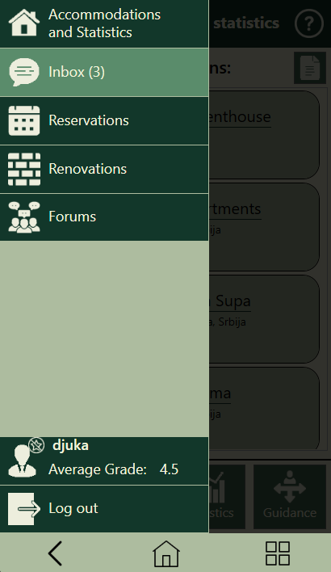
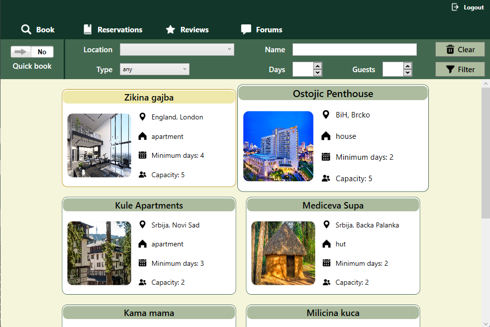
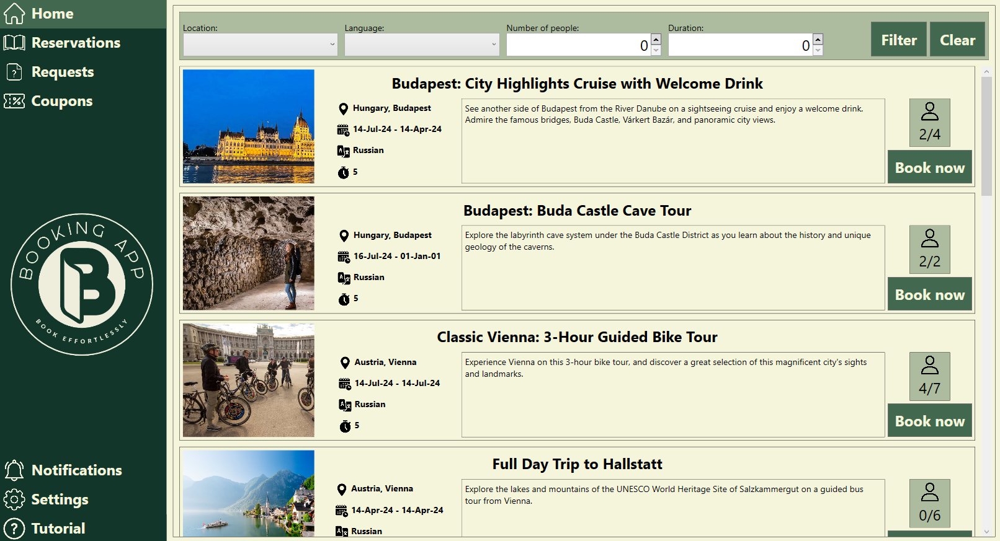
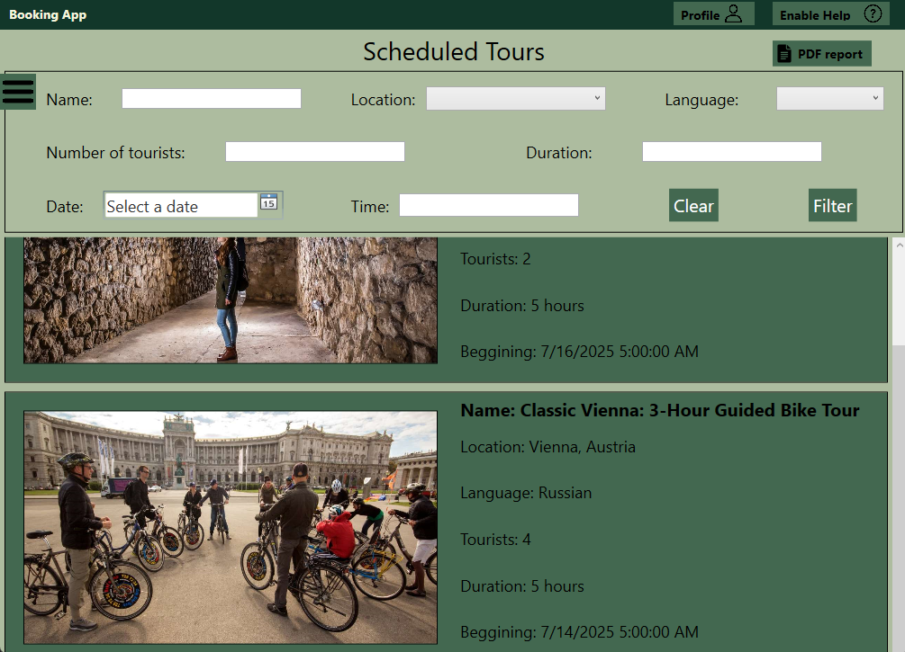
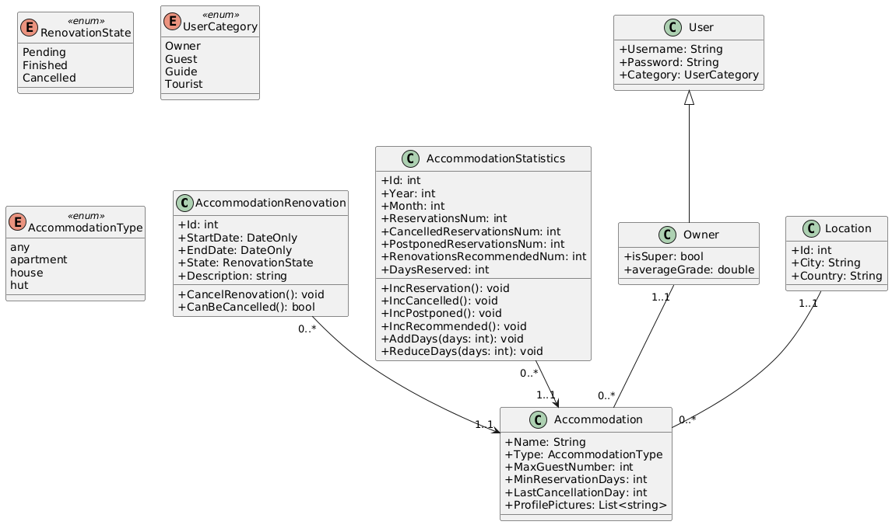
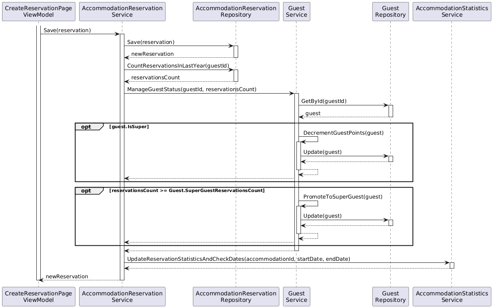

# Booking App

  

  This project was done for two cources: *Software specification and modeling* and *Human Computer Interaction*. Development required comprehensive understanding and application of principles such as SOLID and Clean Code, along with a deep understanding of different user roles. Each type of user had a specifically designed interface tailored to their needs and functions. For instance, property owners managed property registration, reservations, and statistics, while guests searched for, booked, and reviewed properties. The team had to ensure code modularity and maintainability by applying SOLID principles, separating responsibilities, and writing clean, efficient code. This combination allowed for easy system scalability and sustainability in future uses.

## User interfaces

### Owner (Mobile interface)

  
  

### Guest (Web interface)

### Tourist (Desktop interface)

### Guide (Tablet interface)

## Documentation

The `Docs` directory contains essential design and modeling files for the project. This includes:

- Specification: written in Serbian describing necessary functionalities, user types, use case scenarios and some additional requirements that the project needs to satisfy.

- UI Wireframes: which represent wireframes used for designing the user interface. Files can be opened with [Balsamiq](https://balsamiq.com/).

- UML Diagrams: showcasing various UML diagrams such as class diagrams, sequence diagrams, and use case diagrams, helping visualize and structure the system’s architecture and behavior. These diagrams can be viewd at [PlantUML](https://www.plantuml.com/plantuml/uml/SyfFKj2rKt3CoKnELR1Io4ZDoSa70000)

### UML diagram examples

Accommodation class diagram   

Super guest sequence diagram   

## Running the application

To run the app, ensure you have Visual Studio installed with .NET 6.0 SDK. Follow these steps:

1. Clone the repository to your local machine.
2. Open the solution file (`BookingApp.sln`) in Visual Studio.
3. Restore the NuGet packages by right-clicking on the solution in the Solution Explorer and selecting `Restore NuGet Packages`.
4. Build the solution by pressing `Ctrl+Shift+B` or selecting `Build Solution` from the `Build` menu.
5. Run the app by pressing `F5` or selecting `Start Debugging` from the `Debug` menu.

Make sure you have the necessary dependencies and configurations set up in your environment to avoid any runtime issues.

For testing purposes, you can use the following credentials to log in as different user types:

| User Type | Username | Password |
|-----------|----------|----------|
| Owner     | djuka    | djuka    |
| Guest     | nkusla   | nkusla   |
| Tourist   | ostojic  | ostojic  |
| Guest     | medic    | medic    |

## Developer team

- Strahinja Djukic RA 29/2021
- Nikola Kuslakovic RA 8/2021
- Luka Ostojic RA 27/2021
- Milos Medic RA 105/2021