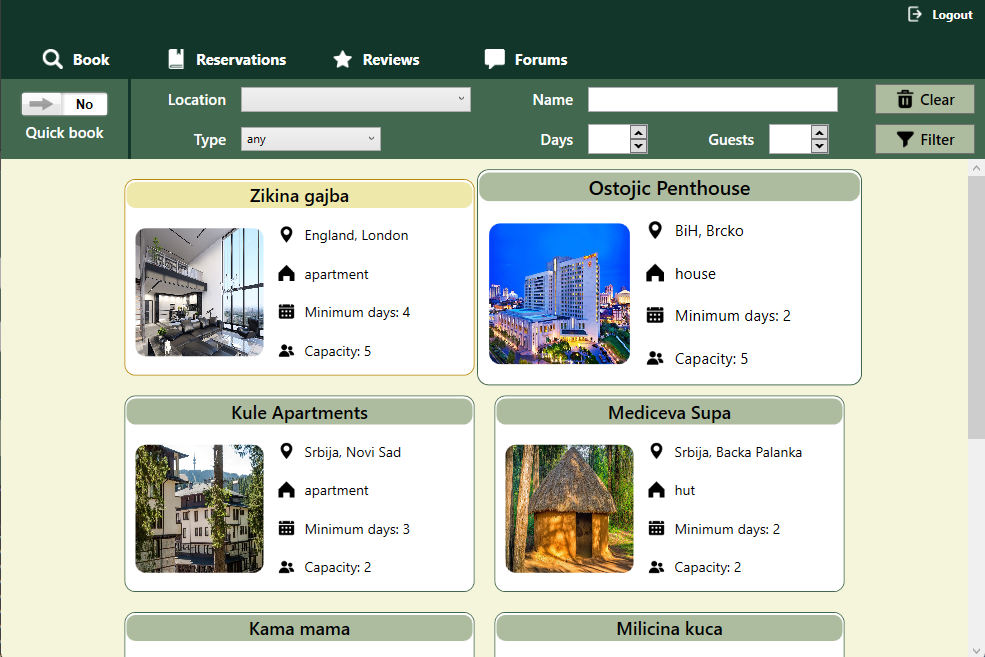

# Booking App

  

  This project was done for the course *Software specification and modeling*. Development required comprehensive understanding and application of principles such as SOLID and Clean Code, along with a deep understanding of different user roles. Each type of user had a specifically designed interface tailored to their needs and functions. For instance, property owners managed property registration, reservations, and statistics, while guests searched for, booked, and reviewed properties. The team had to ensure code modularity and maintainability by applying SOLID principles, separating responsibilities, and writing clean, efficient code. This combination allowed for easy system scalability and sustainability in future uses.

## User interfaces

### Guest

### Owner

### Guide

### Tourist

## Documentation

The `Docs` directory contains essential design and modeling files for the project. This includes:

- Specification: written in Serbian describing necessary functionalities, user types, use case scenarios and some additional requirements that the project needs to satisfy.

- UI Wireframes: which represent wireframes used for designing the user interface. Files can be opened with [Balsamiq](https://balsamiq.com/).

- UML Diagrams: showcasing various UML diagrams such as class diagrams, sequence diagrams, and use case diagrams, helping visualize and structure the system’s architecture and behavior. These diagrams can be viewd at [PlantUML](https://www.plantuml.com/plantuml/uml/SyfFKj2rKt3CoKnELR1Io4ZDoSa70000)

### UML diagram example

Accommodation class diagram   

Super guest sequence diagram   

## Developer team

- Nikola Kuslakovic RA 8/2021
- Strahinja Djukic RA 29/2021
- Luka Ostojic RA 27/2021
- Milos Medic RA 105/2021